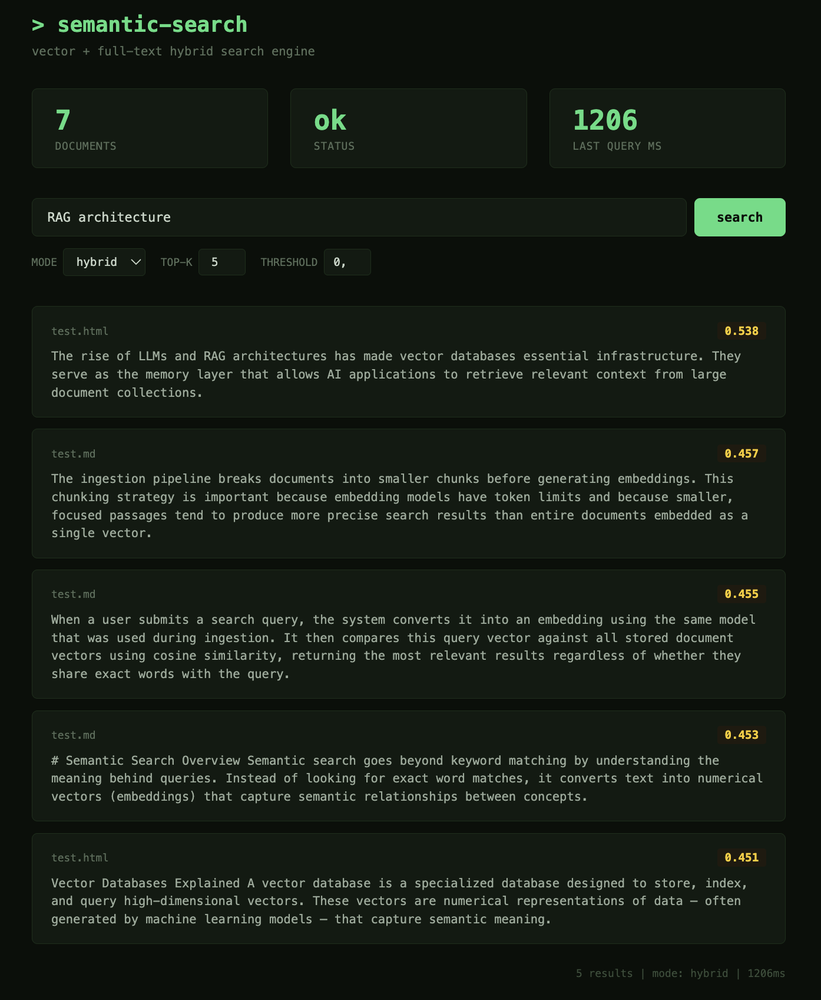

# Semantic Search Engine

Vector search engine that converts text into embeddings and finds semantically similar content using pgvector.

You load documents, ask a question in plain text, and get back the most relevant chunks ranked by meaning — not by keyword matching.

<details>
<summary>Dashboard preview</summary>



</details>

### Example

Ingest a document about search, databases and ML. Then query "how does login work":

```
 id |                      preview                       | similarity
----+----------------------------------------------------+-----------
  1 | Authentication in modern web applications relies   |     0.872
  2 | Database indexing improves query performance...    |     0.614
  3 | Machine learning models require large datasets...  |     0.580
```

The engine found the auth chunk even though the query "login" never appears in the text. That's the difference between keyword search and semantic search — it matches by meaning.

### How similarity works

Each text chunk becomes a 768-dimensional vector (a list of 768 numbers). Similar meanings produce vectors that point in similar directions. Cosine similarity measures this: `1.0` = identical, `0.0` = unrelated. In the example above, "how does login work" is closest to the authentication chunk (0.87) because they share the same semantic space, even without common words.

### How it works under the hood

1. **Ingest**: Load `.md`/`.txt`/`.html`/`.pdf` files → split into chunks → send to Gemini `gemini-embedding-001` → store vectors in pgvector
2. **Search**: Query text → Gemini embedding → hybrid search (vector 70% + full-text 30%) → ranked results

## Tech Stack

- TypeScript (ES2024, strict mode)
- PostgreSQL + pgvector (vector search) + tsvector (full-text search)
- Gemini Embedding API (`gemini-embedding-001`, 768 dimensions)
- Hono (HTTP server)
- Vitest (integration tests)
- Docker (full stack via `docker compose up`)

## Setup

```bash
npm install
cp .env.example .env  # add your GEMINI_API_KEY
docker compose up -d
npm run db:migrate
npm run db:verify
```

Or run the full stack in Docker:

```bash
GEMINI_API_KEY=your-key docker compose up
```

## Usage

### Ingest documents

Supports `.md`, `.txt`, `.html`, `.pdf`:

```bash
npm run ingest -- ./docs
```

### Search via CLI

```bash
npm run search -- "how does authentication work"
```

### Dashboard

```bash
npm run dev
# open http://localhost:3420
```

### Search via API

```bash
curl -X POST http://localhost:3420/search \
  -H "Content-Type: application/json" \
  -d '{"query": "how does authentication work", "mode": "hybrid", "topK": 5}'
```

### Get context for RAG

```bash
curl -X POST http://localhost:3420/v1/context \
  -H "Content-Type: application/json" \
  -d '{"query": "how does auth work", "topK": 3}'
```

### API endpoints

- `GET /` — search dashboard
- `GET /health` — service status and document count
- `POST /search` — semantic search. Body: `{ query, topK?, threshold?, source?, mode? }`
- `POST /v1/context` — RAG context retrieval. Body: `{ query, topK?, threshold?, source? }`

### SDK client

```typescript
import { SemanticSearchClient } from './src/sdk/index.js';

const client = new SemanticSearchClient('http://localhost:3420');

const results = await client.search({ query: 'vector databases', topK: 3 });
const context = await client.getContext('how does auth work');
```

## Project Structure

```
src/
  config.ts              — centralized configuration and constants
  types.ts               — Chunk and EmbeddedChunk interfaces
  cli.ts                 — CLI for ingest and search commands
  server.ts              — Hono HTTP server + dashboard
  dashboard/
    index.html           — minimalist search UI (dark-green theme)
  db/
    pool.ts              — PostgreSQL connection pool
    migrate.ts           — Schema migration (pgvector + tsvector)
    verify.ts            — Database health check
    repository.ts        — Batch insert, delete, count operations
  ingestion/
    loader.ts            — Load files from directory (md, txt, html, pdf)
    chunker.ts           — Split text into chunks
  parsers/
    index.ts             — Parser registry and format detection
    text.ts              — Plain text / markdown parser
    html.ts              — HTML parser (noise tag removal via cheerio)
    pdf.ts               — PDF text extraction
  providers/
    gemini.ts            — Gemini embedding API client with LRU cache
  search/
    search.ts            — Vector, full-text, and hybrid search
  sdk/
    client.ts            — HTTP client for external integration
    index.ts             — SDK exports
  utils/
    vector.ts            — Vector string formatting
    cache.ts             — LRU cache with TTL
tests/
  search.test.ts         — Integration tests verifying semantic relevance
scripts/
  cheatsheet.sql         — Useful SQL queries for debugging
```

## Key decisions

- **Hybrid search** — combines vector similarity (70%) with PostgreSQL full-text search (30%) for better relevance
- **pgvector over Pinecone/Weaviate** — runs locally, no vendor lock-in, standard SQL for filtering
- **768 dimensions** — Gemini `gemini-embedding-001` supports Matryoshka embeddings, truncated from 3072 to 768 for pgvector ivfflat index compatibility
- **taskType separation** — `RETRIEVAL_DOCUMENT` for ingestion, `RETRIEVAL_QUERY` for search queries, improves relevance
- **Batch insert** — 50 rows per query instead of one-by-one for faster ingestion
- **LRU embedding cache** — repeated queries skip the Gemini API call (200 entries, 10min TTL)
